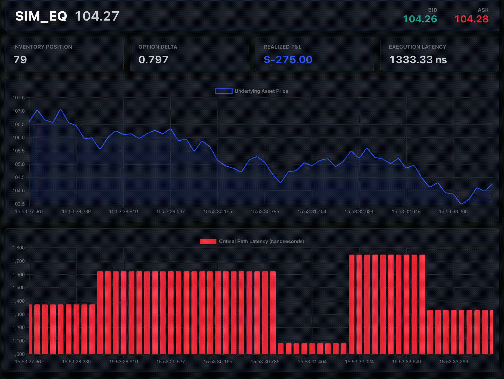
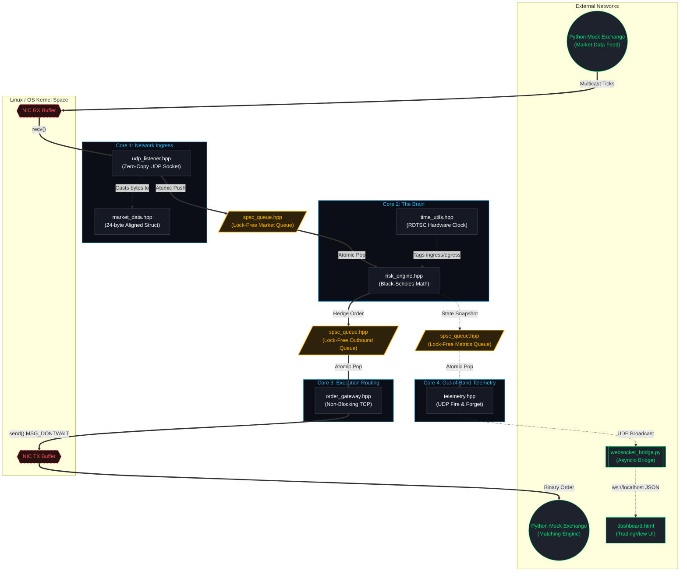
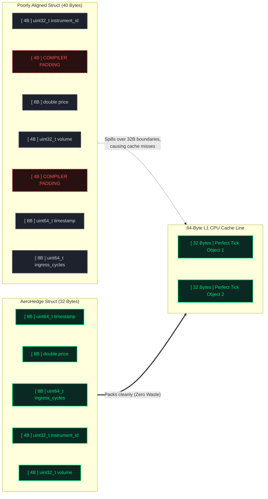
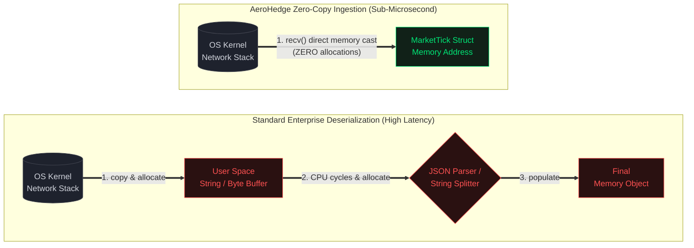
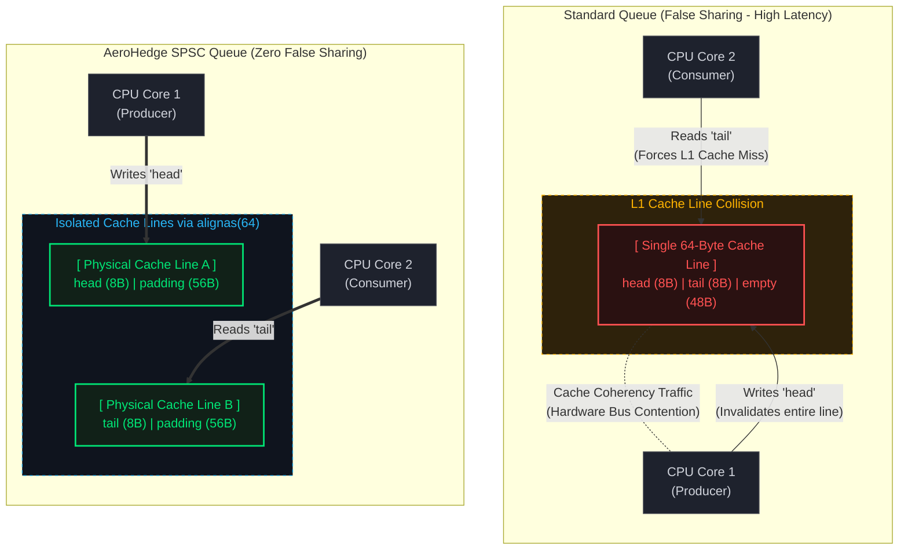

# AeroHedge: Zero-Allocation C++ Options Execution Engine




## Project Overview

**AeroHedge** is a deterministic, high-frequency options delta-hedging simulator built from the ground up in C++. It is designed to ingest streaming market data, compute real-time risk metrics using a heavily optimized Black-Scholes pricing model, and route execution orders over a network boundary—all while maintaining strict zero-allocation memory policies on the critical path.

The primary objective of this project is to demonstrate **mechanical sympathy, concurrent programming, and network I/O optimization** in a simulated High-Frequency Trading (HFT) environment.

---

## Quantitative Finance Theory: The Engine's Brain

To understand the architecture, one must understand the mathematical problem the engine is attempting to solve at microsecond speeds.

### 1. Options & Delta Hedging

An option is a derivative contract whose value is tied to an underlying asset (like a stock).

* **Delta ($\Delta$)** represents the rate of change of the option's price with respect to the price of the underlying asset.
* If an option has a Delta of `0.5`, its price will increase by \$0.50 for every \$1.00 increase in the underlying stock.

**The Goal:** Market makers and volatility traders do not want directional risk (betting if the stock goes up or down). They want to be **Delta-Neutral** ($\Delta = 0$). If a trader holds a portfolio of options, the C++ engine dynamically buys or sells shares of the underlying stock to constantly offset the options' Delta as the market moves.


### 2. The Black-Scholes Model & Computational Bottlenecks

To know *how much* stock to buy/sell, the engine must constantly recalculate Delta using the Black-Scholes formula.

The standard Black-Scholes formula for the Delta of a Call Option is:


$$\Delta = \Phi(d_1)$$

Where $d_1$ is calculated as:


$$d_1 = \frac{\ln(S/K) + (r + \frac{\sigma^2}{2})t}{\sigma\sqrt{t}}$$


*(S = Stock Price, K = Strike Price, r = Risk-Free Rate, $\sigma$ = Volatility, t = Time to Expiry)*

**The Systems Challenge:** Calculating $\Phi(x)$ (the Cumulative Distribution Function of the Standard Normal Distribution) requires computing the error function (`std::erf`). In standard C++, this involves Taylor series expansions that consume hundreds of CPU clock cycles, devastating our tick-to-trade latency.

**The AeroHedge Solution:** Instead of standard math libraries, AeroHedge implements a highly optimized, branchless polynomial approximation of the Normal CDF (Abramowitz and Stegun). This reduces the math execution time from microseconds to mere nanoseconds.

---

## Technical Objectives & Systems Architecture

AeroHedge abandons traditional enterprise software patterns in favor of bare-metal latency optimization. The system is built around a **Four-Thread Pipeline Topology**.

1. **Zero-Copy Network Ingestion:** Market data arrives as raw binary structures via UDP Multicast. The engine casts pointers directly over the network buffer, avoiding string parsing, JSON deserialization, or heap allocation.
2. **Lock-Free Concurrency:** Standard `std::mutex` locks require OS kernel context switches, which induce jitter. AeroHedge utilizes custom **Single-Producer-Single-Consumer (SPSC) Ring Buffers** using `std::atomic` instructions for sub-microsecond thread communication.
3. **Cache-Line Alignment:** Memory structures are padded (`alignas(64)`) to exactly match modern CPU L1 cache lines (64 bytes). This physically isolates variables on the silicon, entirely eliminating "False Sharing" between CPU cores.
4. **Hardware Micro-Benchmarking:** Software timers (`std::chrono`) rely on system calls. AeroHedge measures its own critical path latency by reading directly from the CPU's Time-Stamp Counter (RDTSC register), tracking execution speeds down to the single clock cycle.
5. **Out-of-Band Telemetry:** The engine cannot pause to update a UI. Instead, it asynchronously blasts binary state snapshots over a secondary UDP port to a Python/WebSocket bridge, which drives a real-time institutional dashboard.



---


## Build and Run Instructions

This project is built to execute in a pure Unix-like environment. The execution sequence requires bringing the external networks online before booting the C++ execution core.

### Step 1: Initialize the Environment

Open your terminal and clone the repository. You will need three separate terminal windows to run the full simulation pipeline.

### Step 2: Spin up the Exchange Simulator

In Terminal 1, boot the mock exchange. This script spins up a background TCP server on port `9999` (to accept your engine's trades) and immediately begins blasting binary UDP market ticks to multicast group `239.255.0.1:9000`.

```bash
python3 mock_exchange.py

```

### Step 3: Spin up the Telemetry Bridge

In Terminal 2, start the asynchronous observation bridge. This listens for the engine's UDP telemetry and hosts the `ws://localhost:8765` WebSocket for the dashboard.

```bash
python3 websocket_bridge.py

```

### Step 4: Launch the Dashboard

Simply double-click the `dashboard.html` file to open it in any modern web browser (Chrome/Safari). It will immediately connect to the Python bridge and wait for data.

### Step 5: Compile and Ignite the C++ Core

In Terminal 3, compile the engine. Using `g++-15`, ensure you compile with the `-O3` flag for maximum compiler optimizations, and `-pthread` to link the POSIX threading libraries. Executing your `ccpp.zsh` shell file via the `fn + f5` shortcut will perfectly handle this compilation and execution sequence.

```bash
# Manual compilation reference:
g++-15 -std=c++20 -O3 -pthread main.cpp -o aerohedge
./aerohedge

```

### The Result

The moment the `aerohedge` binary executes, it binds to the CPU cores and begins pulling ticks from the kernel.

* Look at **Terminal 1**: You will see the matching engine instantly printing `=> [MATCHED] BUY 10 shares @ $100.52` as your C++ engine dynamically hedges.
* Look at the **Dashboard**: The UI will light up, streaming the live asset price, your real-time P&L, and printing a live histogram proving the engine's sub-microsecond hardware latency.

---

## Project Structure and Module Functionality

### 1. The Memory Skeleton: [`market_data.hpp`](https://www.google.com/search?q=%5Bhttps://github.com/QuietkidAniket/AeroHedge/blob/main/market_data.hpp%5D(https://github.com/QuietkidAniket/AeroHedge/blob/main/market_data.hpp))

In high-frequency trading, if your data structures are improperly aligned, your entire pipeline is bottle-necked by memory access latency. This file defines the `MarketTick` struct, the atomic unit of data traveling through the system.

What makes this file critical is **Struct Packing**. Variables are ordered strictly from largest byte size to smallest:

* `uint64_t timestamp` (8 bytes)
* `double price` (8 bytes)
* `uint64_t ingress_cycles` (8 bytes)
* `uint32_t instrument_id` (4 bytes)
* `uint32_t volume` (4 bytes)

If a 4-byte integer is placed before an 8-byte double, the C++ compiler silently injects 4 bytes of empty "padding" to maintain memory alignment. By optimizing the order, this struct packs perfectly into 32 bytes with zero wasted memory. Modern CPUs pull memory into L1 cache lines in 64-byte chunks. A 32-byte struct ensures that exactly two market ticks fit perfectly into a single cache line, drastically reducing cache miss ratios during sequential reads.



---

### 2. Bypassing the Kernel Clock: [`time_utils.hpp`](https://www.google.com/search?q=%5Bhttps://github.com/QuietkidAniket/AeroHedge/blob/main/time_utils.hpp%5D(https://github.com/QuietkidAniket/AeroHedge/blob/main/time_utils.hpp))

Measuring nanosecond latency using standard libraries like `std::chrono` is counterproductive, as calling the OS clock introduces microsecond-level system calls and context switches. This file solves that latency trap by talking directly to the silicon.

The `TSCClock` class implements hardware-level timekeeping. Depending on the architecture, it issues the `__rdtsc()` assembly instruction (for x86/Linux) or `mach_absolute_time()` (for macOS). These instructions read the Time-Stamp Counter register on the CPU, returning the exact number of clock cycles executed since the machine booted. Crucially, this read takes only a single CPU cycle. Because clock cycles are not absolute time, the class runs a `calibrate()` function on startup, measuring the `cycles_per_ns_` ratio to mathematically convert CPU spins into human-readable latency without interrupting the critical path.

---

### 3. The Zero-Copy Catch: [`udp_listener.hpp`](https://www.google.com/search?q=%5Bhttps://github.com/QuietkidAniket/AeroHedge/blob/main/udp_listener.hpp%5D(https://github.com/QuietkidAniket/AeroHedge/blob/main/udp_listener.hpp))

This module represents the boundary where the engine touches external market data. The `UdpListener` is designed to bind to a UDP multicast group and pull binary data out of the Linux kernel network stack.

The latency reduction occurs inside the `listen_and_publish` loop. The network socket read operation executes as: `recv(socket_fd_, &tick, sizeof(MarketTick) - sizeof(uint64_t), 0)`.

* The system does not read bytes into a temporary buffer to be parsed later.
* It passes the memory address (`&tick`) of a pre-allocated stack variable directly to the kernel.
* The OS drops the incoming bytes directly into the C++ struct memory footprint.
* The system reads exactly 24 bytes (accounting for the 8-byte internal `ingress_cycles` tracker) because the exchange standard packet is exactly 24 bytes.

At the exact microsecond the `recv()` completes, the thread calls `global_clock.rdtsc()` to tag the `ingress_cycles`, stamping the data before instantaneously pushing it to the lock-free queue.


---

### 4. The Lock-Free Highway: [`spsc_queue.hpp`](https://www.google.com/search?q=%5Bhttps://github.com/QuietkidAniket/AeroHedge/blob/main/spsc_queue.hpp%5D(https://github.com/QuietkidAniket/AeroHedge/blob/main/spsc_queue.hpp))

If the ingestion layer used a standard `std::mutex` to hand data to the math engine, the thread would have to ask the OS kernel for permission to lock the memory, destroying determinism. The `SPSCQueue` (Single-Producer Single-Consumer) entirely bypasses the OS scheduler.

This is the most intricate concurrent C++ implementation in the project, designed to manipulate CPU cache mechanics:

* **The Bitwise Trick:** The array `Capacity` must be a power of 2. Instead of finding the next ring index using slow modulo division (`head % Capacity`), it utilizes a bitwise AND (`(current_head + 1) & Mask`), executing in a single clock cycle.
* **Memory Fencing:** It enforces strict C++ atomics (`memory_order_relaxed`, `memory_order_acquire`, `memory_order_release`) to prevent the compiler or CPU from reordering instructions out of sequence. The `release` flag guarantees that the actual data is written to RAM *before* the consumer thread is permitted to see the updated index.
* **False Sharing Prevention:** The `alignas(64)` tags on the `head_` and `tail_` atomic indices are vital. If these two variables sat adjacent in memory, Core 1 (writing to head) and Core 2 (reading from tail) would continuously invalidate each other's L1 cache line, causing catastrophic bus traffic. Padding them to 64 bytes forces them onto completely isolated physical silicon pathways.


---

### 5. The Math Engine: [`risk_engine.hpp`](https://www.google.com/search?q=%5Bhttps://github.com/QuietkidAniket/AeroHedge/blob/main/risk_engine.hpp%5D(https://github.com/QuietkidAniket/AeroHedge/blob/main/risk_engine.hpp))

This module operates as the quantitative brain of the trading system. It pops ticks off the lock-free queue, computes the Black-Scholes pricing model, manages current inventory, and determines if a hedging trade is required.

* **Functionality:** Real-time Delta calculation and Order Generation.
* **Intricate Detail:** The Black-Scholes formula requires the calculation of the Cumulative Distribution Function (CDF) of the Standard Normal Distribution. Using the standard C++ library `std::erf` (error function) consumes roughly 150–200 CPU clock cycles due to extreme scientific precision requirements. In options market making, precision past a certain decimal is irrelevant if it causes a missed execution.
To solve this, the engine implements `fast_cdf()`: a **branchless polynomial approximation** based on the Abramowitz and Stegun formula. Utilizing hardcoded constants and single-cycle arithmetic operations (`+`, `*`), it computes the option's Delta in under 10 nanoseconds without branching logic (which would otherwise risk pipeline flushes on branch mispredictions).

---

### 6. The Execution Gateway: [`order_gateway.hpp`](https://www.google.com/search?q=%5Bhttps://github.com/QuietkidAniket/AeroHedge/blob/main/order_gateway.hpp%5D(https://github.com/QuietkidAniket/AeroHedge/blob/main/order_gateway.hpp))

Once the Risk Engine determines a hedge is necessary, it constructs a 24-byte `OrderRequest` struct and pushes it to the outbound queue. The `OrderGateway` thread pops it and routes the binary payload to the exchange.

* **Functionality:** Deterministic, non-blocking TCP IPv4 transmission.
* **Intricate Detail:** TCP guarantees delivery, making it inherently dangerous for latency. If the exchange matching engine is slow to acknowledge packets, the OS kernel will eventually fill up the NIC's transmission buffer and block (suspend) the executing thread.
This module immunizes the engine by configuring the socket to `O_NONBLOCK` via `fcntl`, and enforcing `MSG_DONTWAIT` on the `send()` call. If the kernel buffer is full, `send()` immediately returns an `EWOULDBLOCK` error. Instead of crashing or yielding the thread to the OS, the C++ thread enters a "hot spin," continuously retrying the send operation in user-space until a microsecond window opens, ensuring the system never surrenders its CPU core.

---

### 7. Overcoming the "Observer Effect": The Telemetry Pipeline

A classic systems engineering challenge is observing a low-latency application without impacting its performance. String formatting, JSON serialization, and UI rendering are catastrophically slow. If the C++ Execution Thread paused to update a dashboard, the p99 latency would spike from nanoseconds to milliseconds.

AeroHedge completely decouples execution from observation using a three-stage, out-of-band telemetry architecture:

1. **Fire and Forget ([`telemetry.hpp`](https://www.google.com/search?q=%5Bhttps://github.com/QuietkidAniket/AeroHedge/blob/main/telemetry.hpp%5D(https://github.com/QuietkidAniket/AeroHedge/blob/main/telemetry.hpp))):** On every processed tick, the C++ Risk Engine executes a lightning-fast memory copy of its state (Delta, P&L, Inventory) to an asynchronous `MetricsQueue`. A 4th C++ thread pops this struct and blasts it over a local UDP socket. There are no strings or JSON payloads—just raw binary. If the UDP packet drops under high load, the core engine is entirely unaffected.
2. **The Bridge ([`websocket_bridge.py`](https://www.google.com/search?q=%5Bhttps://github.com/QuietkidAniket/AeroHedge/blob/main/websocket_bridge.py%5D(https://github.com/QuietkidAniket/AeroHedge/blob/main/websocket_bridge.py))):** An asynchronous Python process listens on the local UDP port. It absorbs the heavy computational penalty of unpacking the binary struct and serializing it into a JSON string, subsequently hosting a WebSocket server to broadcast the telemetry stream.
3. **The Terminal ([`dashboard.html`](https://www.google.com/search?q=%5Bhttps://github.com/QuietkidAniket/AeroHedge/blob/main/dashboard.html%5D(https://github.com/QuietkidAniket/AeroHedge/blob/main/dashboard.html))):** A custom HTML5/JS dashboard connects to the WebSocket. It renders the live order book spread, charts underlying asset movement at 60 FPS, and plots a dynamic, color-coded histogram of the C++ engine's hardware-timed execution latency.
---